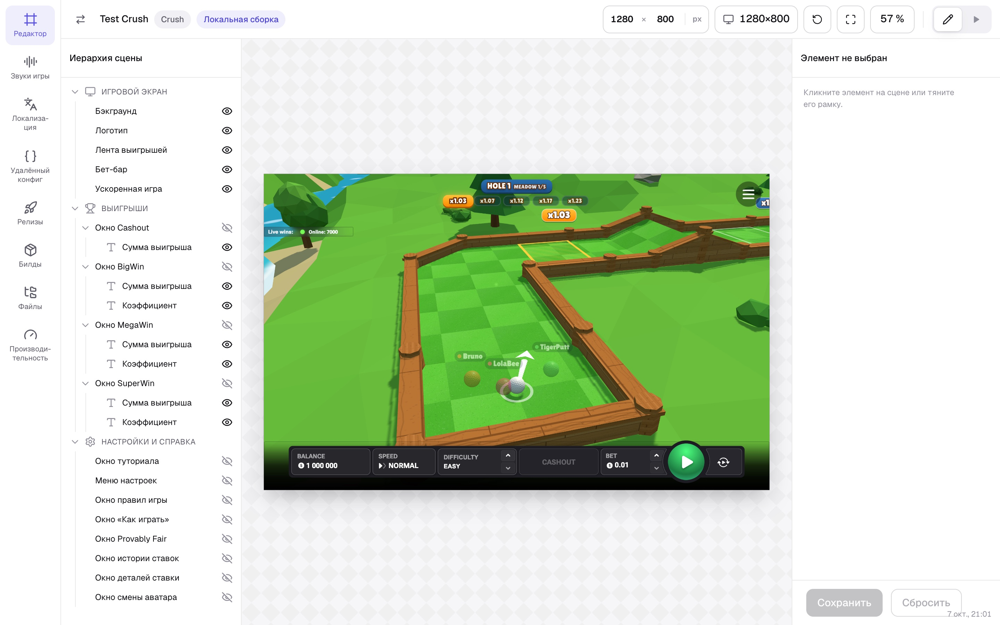
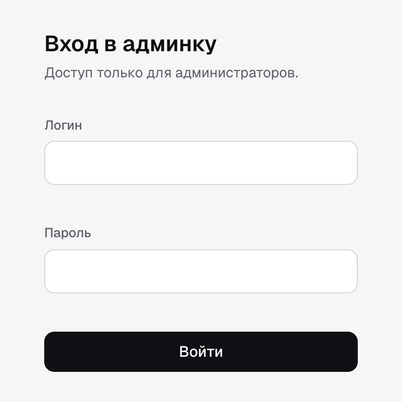
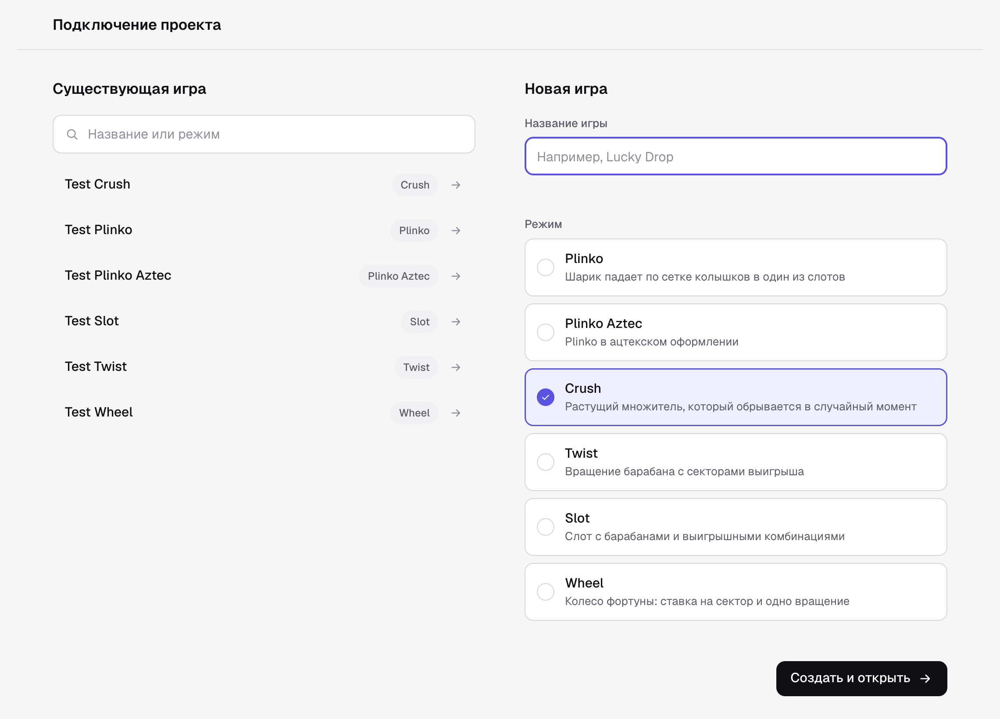
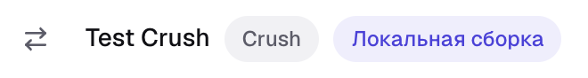

# @omega/webbridge-js

Игровая сторона моста для веб-игр — Phaser, Pixi, three.js, любой JS-движок — то же, что `unity/Assets/WebBridge` для Unity.
Имена классов, методов и событий сознательно зеркалят C#, чтобы корневой
`README.md` описывал оба моста разом:

| C# | TS |
|---|---|
| `WebBridgeBase<T>` | `BridgeBase` |
| `RoadWebBridge` | `CrushBridge` |
| `event Action<T>` | `Signal<T>` |
| `WebBridgeUtils.Send` | `BridgeTransport.send` |
| `WebBridgeUtils.*LocalStorage` | `BridgeStorage` |
| `WebBridgeLogger` | `BridgeLogger` |

## Архитектурные границы

1. **Ядро не знает про движок.** `BridgeBase`/`CrushBridge` работают с
   `BridgeTransport` — интерфейсом «отправить `EngineEvent`». Хост веб-игры
   появляется только в `web/createWebBoot.ts`.
2. **Ядро не знает про строки.** Парсинг `SendMessage`-строк — беда одного лишь
   Unity; сюда команда приходит уже структурой. Исключение — `ApplyGameConfig` /
   `ApplyGameState` / `ApplyTranslations`, которые контрактом объявлены строками
   (на них держится дедуп во фронтенде), их мост парсит сам.
3. **Игра зависит от моста, мост от игры — нет.** То же правило, что и в Unity:
   сцены подписываются на сигналы моста, мост не импортирует ни одной игровой сущности.

## Метрики хоста

`desktopBetBarViewportMetricsReceived` / `mobileBetBarViewportMetricsReceived` отдают
JSON-строку как есть; её форма — `BetBarViewportMetricsPayload` (реэкспорт из
протокола). Все величины — доли холста 0..1: `heightEndViewport` — сколько снизу
закрывает бет-бар, `heightStartViewport` — сколько сверху закрывает полоса Live wins
(нет поля — сверху ничего).

## Точка входа

```ts
import { createWebBoot, registerWebBoot, CrushBridge } from '@omega/webbridge-js';

registerWebBoot(
  createWebBoot({
    createBridge: (transport) => new CrushBridge(transport),
    createGame: (bridge, container, options) => new Phaser.Game(makeConfig(bridge, container, options)),
    destroyGame: (game) => game.destroy(true),
  }),
);
```

Движок любой: для Pixi `createGame` создаёт `Application` в `container` (разрешение —
`options.devicePixelRatio`), `destroyGame` зовёт `app.destroy()`. `registerWebBoot`
выставляет фабрику как `__WEB_GAME_BOOT__` и под прежним именем `__PHASER_BOOT__` —
его ищут шеллы старых тегов. `createPhaserBoot` / `PhaserBootConfig` остаются
устаревшими синонимами.

## Как связать игру с конфигуратором

Плагин `localBuildServer` запускает игру, которую вы сейчас пишете, внутри настоящего
шелла в редакторе раскладки конфигуратора. Собирать и загружать билд не нужно:
код игры берётся с вашего dev-сервера, а конфигурация, раскладка интерфейса и бэкенд —
со стенда. Сохранили файл — страница в редакторе перезагрузилась с новым кодом.



### Что понадобится

- Игра собирается на **Vite**, `@omega/webbridge-js` **1.12.0 или новее**.
- Точка входа бандла отдаёт игру шеллу через `registerWebBoot` (см. «Точка входа» выше).
- Аккаунт в админке и **Chrome на компьютере**: шелл берёт код только с `localhost`.

### Шаг 1. Подключить плагин

```ts
// vite.config.ts
import { defineConfig } from 'vite';
import { localBuildServer } from '@omega/webbridge-js/vite';

export default defineConfig({
  plugins: [localBuildServer({ entry: '/src/bridge/boot.ts', mode: 'crush' })],
  server: { port: 5180 },
});
```

| Опция | Что это |
|---|---|
| `entry` | Точка входа бандла — файл, который вызывает `registerWebBoot`. Обязательна. |
| `mode` | Режим игры (`crush`, `plinko`, `slot`, …). Админка подставит его, когда вы будете заводить новую игру. |
| `configuratorUrl` | Адрес админки. По умолчанию боевая; для локальной — ровно тот адрес, по которому вы её открываете, например `http://127.0.0.1:3000`. |

Порт задайте явно и не меняйте: плагин включает `strictPort`, и полные адреса
ассетов строятся по нему.

### Шаг 2. Запустить dev-сервер

```bash
npm run dev
```

Плагин сам откроет админку в браузере и напечатает её адрес в консоль — на случай,
если браузер не открылся:

```text
  WebBridge admin: https://games.omega.keitarocab.link/admin/connect?localBuild=http%3A%2F%2Flocalhost%3A5180&mode=crush
```

### Шаг 3. Войти в админку

Если вы ещё не входили, админка покажет форму входа. После входа она сама вернёт
на страницу подключения — ссылку из консоли открывать заново не нужно.



### Шаг 4. Выбрать игру

Админка спросит, с какой игрой связать проект. Это делается **один раз на проект**.



- **Существующая игра** — нажмите на неё в списке слева. Поиск понимает название и режим.
- **Новая игра** — введите название справа; режим уже выбран по опции `mode`.
  Нажмите «Создать и открыть».

Если компаний несколько, сверху появится выбор компании — игра заведётся в выбранной.

### Шаг 5. Закоммитить `webbridge.json`

Админка передаёт выбор dev-серверу, и тот записывает в корень проекта файл:

```json
{
  "gameId": "test-crush"
}
```

Закоммитьте его — тогда у всей команды проект откроет одну и ту же игру, и экран
подключения больше никто не увидит.

### Шаг 6. Работать в редакторе

Сразу после выбора откроется редактор раскладки этой игры с вашей сборкой.
Шапка показывает, что игра идёт с вашего компьютера:



- **«Локальная сборка»** — код игры берётся с dev-сервера, а не из загруженного билда.
- **⇄** слева от названия — сменить игру проекта: ведёт обратно на экран подключения.
- Правка в коде игры перезагружает страницу в редакторе.

Дальше каждый `npm run dev` открывает сразу этот редактор.

### Если что-то не так

| Что видно | Что делать |
|---|---|
| «Проект по адресу … не запомнил игру. Дев-сервер игры не ответил» | Браузер не различает причины, проверьте по порядку: `npm run dev` запущен и плагин подключён; `@omega/webbridge-js` — 1.12.0+; Chrome спросил доступ к локальной сети — разрешить. Затем «Повторить». |
| «Дев-сервер игры отказал (HTTP 403)» | Админка открыта не по тому адресу, что в `configuratorUrl` (`localhost` и `127.0.0.1` — разные адреса). Откройте её по ссылке из консоли. |
| «Дев-сервер игры отказал» с другим кодом | Плагин не принял запрос — обновите `@omega/webbridge-js` до последней версии. |
| Dev-сервер не стартует: порт занят | Освободите порт или поменяйте `server.port` — связь с игрой хранится в `webbridge.json` и от порта не зависит. |
| Игра не появилась, в консоли `neither window.__PHASER_BOOT__ nor window.__PHASER_GAME__ was set` | `entry` указывает не на тот файл: нужен тот, что вызывает `registerWebBoot`. |
| Картинки, звуки или шрифты игры не грузятся | Адресуйте ассеты от модуля (`import`, `new URL('…', import.meta.url)`): у модуля `document.currentScript` пуст. |
| Не открывается с телефона | Так и задумано: шелл пускает код только с `localhost` / `127.0.0.1` / `[::1]`. |

### Как это устроено

```text
 dev-сервер игры (Vite + localBuildServer)          админка (конфигуратор)
 ─────────────────────────────────────────          ─────────────────────────
 печатает и открывает ссылку на админку  ────────▶  /admin/connect?localBuild=…
 POST /__webbridge/project  ◀── выбранная игра ───  экран «Подключение проекта»
   → пишет webbridge.json
                                                     редактор раскладки
                                                       └─ iframe: шелл стенда
 /game.js (модуль Vite)  ◀── ?localBuild=… ──────────────── грузит игру отсюда
```

- Связь с игрой dev-сервер принимает только с origin админки из `configuratorUrl`.
- Код игры он отдаёт по CORS только страницам стендов и `localhost`.
- Релизный пакет шелла этой возможности не содержит — только стенд.

Без автооткрытия: `server.open: false` в конфиге проекта выключает браузер (ссылка в
консоли остаётся). Можно и совсем вручную: к ссылке на игру со стенда добавить
`&localBuild=http://localhost:5180`.

## Что осталось (скелет)

- `CrushBridge` покрывает базовый цикл (config/state/step/coeffs) и запуск бонуса
  с уведомлениями. Бонус в Crush полноценный — в C#-мосте есть покупка
  (`BonusModePurchased`/`BonusModePurchaseFailed`), режимы магазина
  (`ResolveBonusModesForShop`) и восстановление позиций автоплея
  (`ResolveBonusPositionsForAutoPlay`); здесь этого пока нет;
- нет аналогов `AudioWebBridge`/`LayoutWebBridge` как отдельных классов — сейчас
  их сообщения уходят прямо через `BridgeBase`; выделять в отдельные модули,
  когда набежит логика;
- нет mock-режима с данными (`MockConfig` в C#) — есть только флаг `isMockEnabled`.
